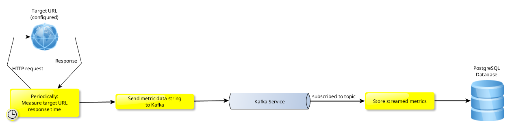
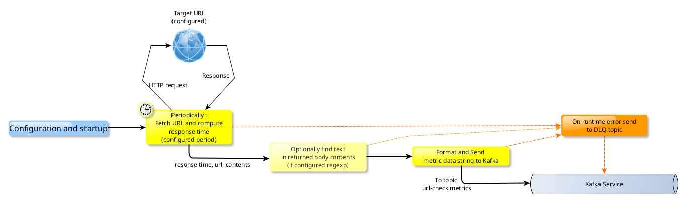
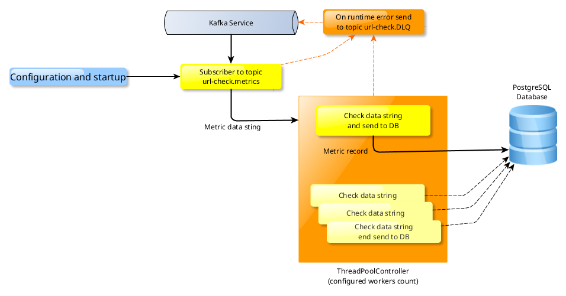

# Check URL facility

This metrics collection facility is designed to : 
- periodically request some configured target URL
- measure round-trip time, until end of body contents reception
- store these metrics in some Postgres database

## The stack
This facility will leverage following services :
- Python as programming language, v3 is fine and leverage `ThreadPoolExecutor`
- Kafka for realtime messages distribution
- Postgres for collected metrics storage

## Required features
This facility is providing with :
- optional lookup for _regexped_ string in fetched target URL body contents
- computing of response times in _milliseconds_
- runtime errors warnings through some _DLQ topic_
- 
## Functional specifications
Simplified functional process can be represented with following schema :


In addition to this (very) simplified functional workflow, this facility must enable :
- multiple producers : **multiple URL checkers** can be launched, both sending metrics to same data bus
- single or multiple consumers : each consumer uses **multiple workers** for throughput configuration
- high throughput, thanks to DB insertion process threading
- configurability
  
## Technical specifications
### Producer : URL check
#### Synopsis
_Producer_ is in charge of : 
- fetching remote target URL
- do the math on request chronology
- eventual string lookup in contents
- forward formatted metric string to Kafka topic


#### Configuration items
The URL checker process accepts following **editable** configuration items :
- *CHECK_TARGET_URL* : the URL to check, may be on *http* or *https* proto
- *CHECK_PERIOD_SECONDS* : the time between each check, in seconds
- *CHECK_CONTENTS_REGEX* (optional) : the regular expression to lookup text with, in body contents

In addition, some internal configuration items are needed :
- kafka topic to send metrics to
- kafka topic used for DLQ
- kafka credentials

### Consumer : metrics record storage
#### Synopsis
_Consumer_ is in charge of :
- subscription to kafka topic
- checking incoming metrics string 
- store this record in Postgres database via one of available workers


#### Configuration items
The metrics storage process accepts following **editable** configuration items :
- *WORKERS_COUNT* : the maximum allowed numbers of workers

In addition,  some internal configuration items are needed :
- kafka topic to consume
- kafka topic used for DLQ
- kafka credentials
- Postgres DSN

### Kafka topics
#### Metrics topic
This topic is named `url-check.metrics`
Is used for high throughput of metrics data messages between processes. 
#### DLQ topic
This topic is named `url-check.DLQ`
Is used for error handling : any runtime error would send a useful message in. 

### Postgres metrics data structure
Metrics data strings are stored in Postgres DB, using a single (partitioned) table :
```sql
CREATE TABLE check_url_metrics (
    url               text not null,
    targetip          inet not null,
    sourceip          inet not null,
    logdate           date not null,
    statuscode        int not null,
    resptimems        float not null,
    regexfound        boolean
);
```
With :
- url : the target URL to check
- targetip : the target reached IP address
- sourceip : the originating IP address 
- logdate : the date the test was launched
- statuscode : the returned HTTP status code
- resptimems : the measured request time, in milli seconds
- regexfound : true if text was found in response body, false otherwise, NULL if not configured in url fetcher (producer)
## How to

## Yet to be done
- bind DLQ kafka topic to some email warn process or the like
- split postrges data into multiple tables, make table partitions
- implement some retry feature so that failed messages are retried a couple of times before DLQ
- implement some "consumer : more workers needed" alerting so that additional consumers can be launched